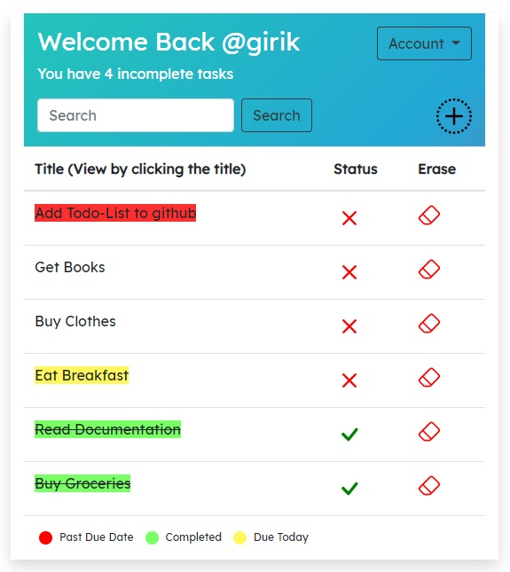

# Django-Todo-LIst
A simple Django Todo-List using Django Class Based Views

This CRM consists of three posts:
- The Owner(Who has access to all agents and leads)
- The Agents(They are under the owner and control the leada)
- The Leads(They are the lowest level)

- The owner can enter agents and leads in the system. Once the owner adds agents in the system, their accounts are automatically created and an -mail is sent to the agents and leads with their username, email and temporary password to access the system.

- The owner can assign leads to agents and monitor which agent has which leads, the owner can unassign leads from agents and remove agents and leads.

- The CRM has boundaries set for every account, that means that an owner has full access to the CRM, the agent can only access his leads, and the leads can only access their profile, they cannot access agents lists or what the owner cans see.



# How to run this: 


Download requirements:
```
pip install -r requirements.txt
```
Then run the python file:
```
python manage.py runserver 
```

# Features:
As an Owner of a company this is what you see: 


- You can create, remove agents.


- You can create leads
- assign/un-assign them to agents 
- create different categories for leads
- add different leads to different categories.


- Check different categories of leads for full management of the crm 


# About the Built:
- Full user authentication
- This project is made using DJango generic Class Based View
- Uses Bootstrap4 for the styling
- Uses django-bootatrap4 forms for the styling.

# The Django-Apps
<table>
<thead>
    <th>Django-App</th>
    <th>Contains</th>
</thead>
<tr><td> agents </td><td>Contains the views for agents</td></tr>
<tr><td> leads </td><td>Dcontains most of the functioning of the website</td></tr>
<tr><td> djcrm </td><td>Main DJango-app</td></tr>
</table>
